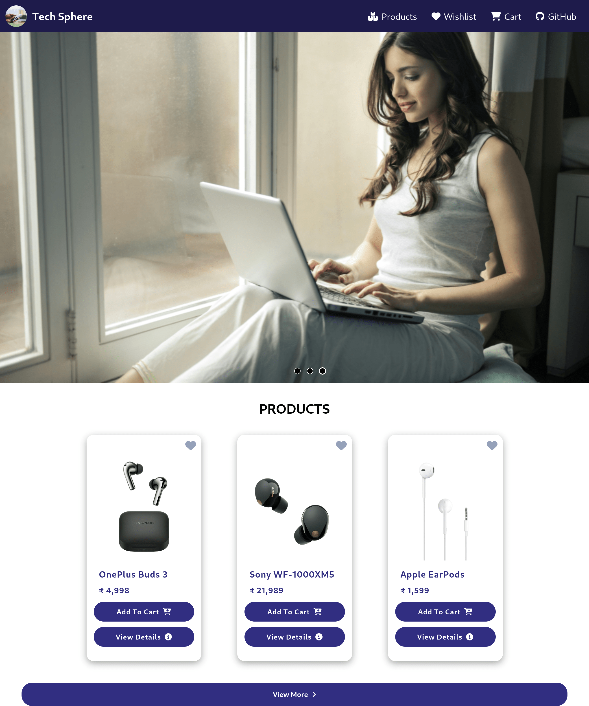

# 💻 Tech Sphere

It provides a seamless and interactive user experience for browsing and purchasing products. It primarily focuses on product listing, cart management, and wishlist management efficiently.

## 🌟 Features

- Product Listing
- Product Search
- Cart Management
- Wishlist Management

## 🛠️ Technologies Used

- Vite + React
- React Router DOM
- Redux Toolkit
- Tailwind CSS 🌈
- Fontawesome Icons

## 🎉 Credits

This project uses the API provided by my friend [Surbhi](https://github.com/Surbhisinghal1234). Thank you for your valuable work!

## 📬 Feedback and Suggestions

Your feedback is valuable! If you have any suggestions, ideas, or improvements for this project, please feel free to open an issue or submit a pull request. Your contributions are welcomed and appreciated 🚀.
